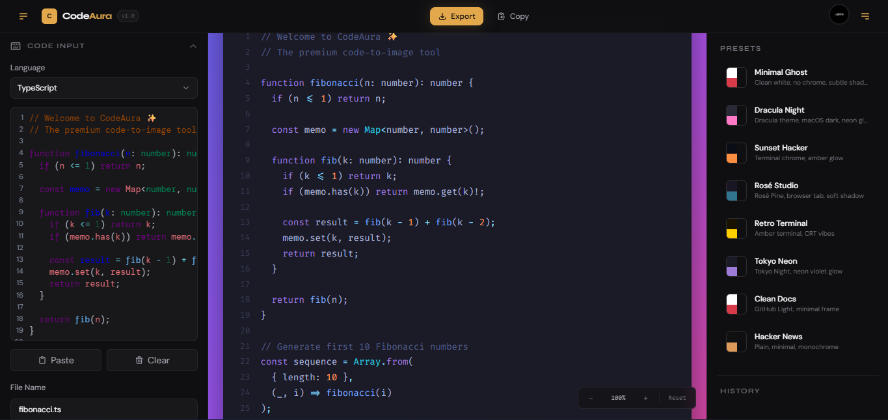
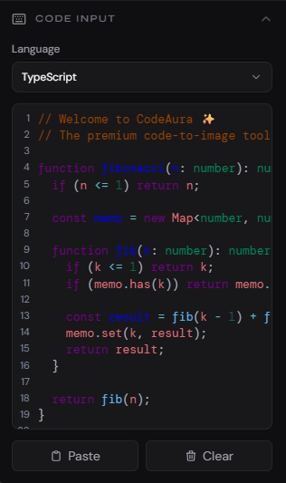
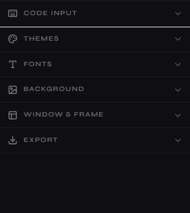
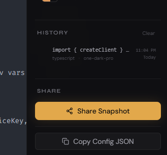
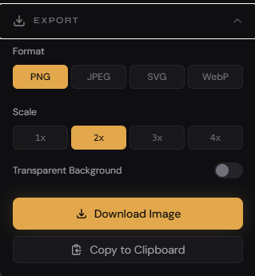

  
  <h1>CodeAura</h1>
  
<strong>A beautiful tool for turning your code into stunning, shareable images.</strong>

  

---

## How to Use CodeAura

Creating eye-catching code snippets with CodeAura is fast and intuitive. Follow these steps to generate your first snapshot!

### 1. Paste Your Code
Simply type or paste your code snippet directly into the main editor window. CodeAura automatically detects your programming language for syntax highlighting, but you can also manually choose a language from the dropdown menu at the top.

### 2. Customize the Appearance
Make the snippet your own by using the right-hand adjustment panels:

- **Theme Panel:** Switch between various beautiful syntax highlighting themes (e.g., dark, light, high-contrast).
- **Background Panel:** Choose a vibrant gradient, a solid color backdrop, or make the background fully transparent.
- **Frame Panel:** Adjust the padding around your code, toggle the macOS-style window controls, and fine-tune the drop shadow depth to make the window pop.
- **Font Panel:** Pick from developer-friendly fonts, and adjust the font size, line height, and weight for maximum readability.

### 3. Manage Your Sessions
As you work, CodeAura automatically saves your progress to your local **History**. 

- **Smart Sessions:** Significant changes (like switching the programming language or entering new code) will create a brand-new history entry.
- **Minor Tweaks:** Modifying styling options (like changing the padding or theme) simply updates your current design without cluttering your history.

If you sign in, your histories and creations will be securely synced across your devices!

### 4. Export & Share
Once your masterpiece is complete, click on the **Export** menu to choose how you want to share it:

- **Download:** Save the final design straight to your computer as a high-resolution `PNG` or `SVG`.
- **Copy to Clipboard:** Copy the image directly to paste into a chat, email, or presentation.
- **Shareable Link:** Generate a unique link to your CodeAura snippet so others can view or remix it!

